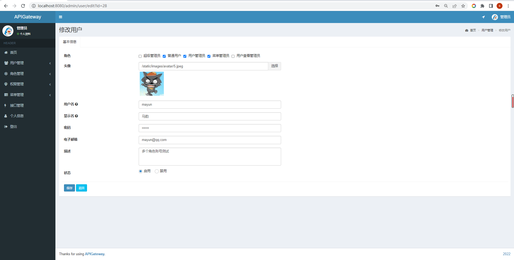
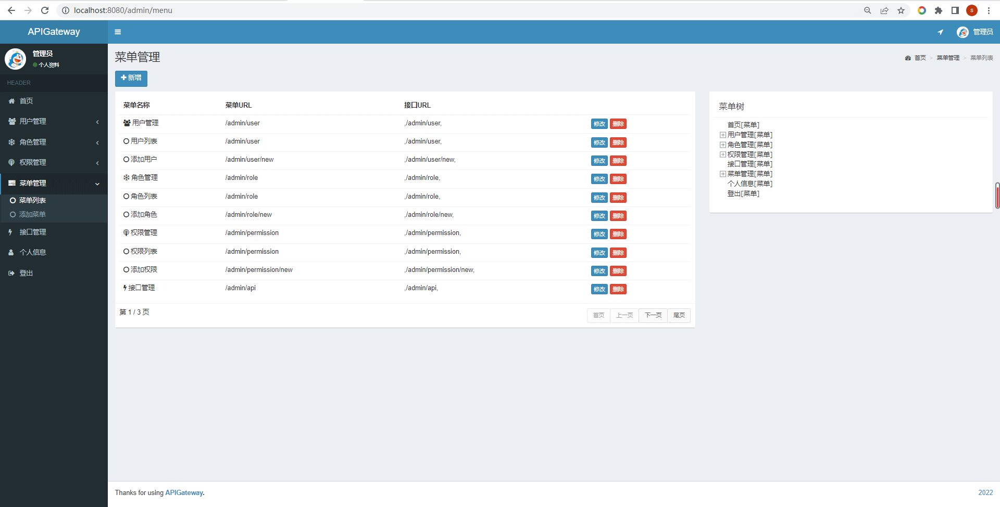
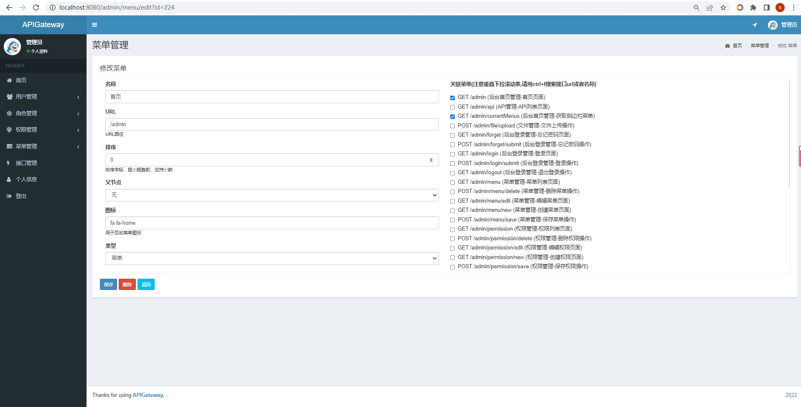
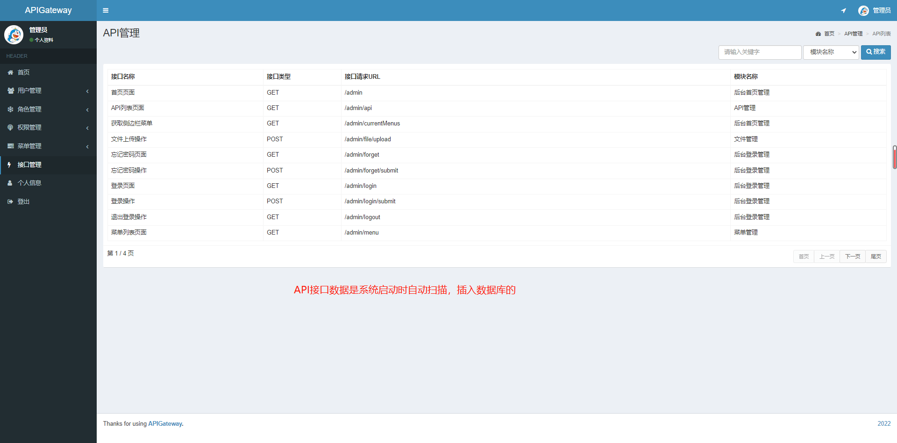

- 2022 基于SpringBoot/SSM的API网关鉴权系统，用户中心管理系统，用户角色权限菜单API资源
- 预览地址：[http://apigateway.liuyanzhao.com](http://apigateway.liuyanzhao.com) （账号admin/123456）
- 详细介绍地址：[https://liuyanzhao.com/shop/apigateway.html](https://liuyanzhao.com/shop/apigateway.html)
- 代码地址：https://github.com/saysky/apigateway 或 https://gitee.com/saysky/apigateway
- 完成时间：2022年5月

# 一、功能介绍
- 该系统包括用户、角色、权限、菜单、API接口等核心模块。
- 可以作为各种系统的用户中心，或者API鉴权平台。

主要功能如下：
- 1. 用户注册，登录、找回密码
- 2. 用户管理，添加，编辑，删除，一个用户可以关联多个角色
- 3. 角色管理，添加，编辑，删除，一个用户可以关联多个角色
- 4. 权限管理，添加，编辑，删除，一个权限可以关联多个角色
- 5. 菜单管理，添加，编辑，删除，一个菜单可以关联多个API
- 6. API管理，API由系统启动时自动根据注解扫描然后插入数据库，页面上只做查看搜索

# 二、技术组成
- 1、SpringBoot 
- 2、MyBatis / MyBatis Plus
- 3、Thymeleaf
- 4、Bootstrap
- 5、MySQL

# 三、项目截图
具体请在预览网站查看

1-首页.png

2-用户管理.png

3-用户编辑.png

4-角色管理.png

5-角色编辑.png

6-权限管理.png

7-编辑权限.png

8-菜单管理.png

9-编辑菜单.png

10-API接口管理.png

11-个人信息.png

# 四、联系方式
需要完整代码联系博主，微信847064370

